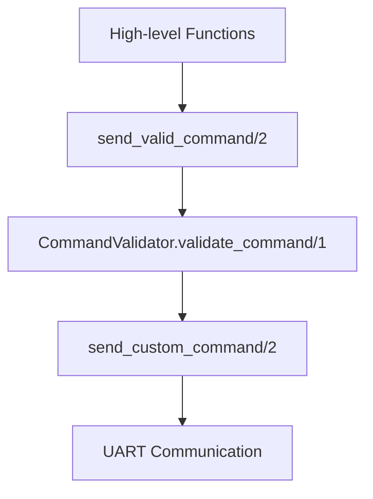

# Command Reference

This guide provides a comprehensive reference for all RoArm robot commands and their parameters.

## Command Architecture

RoArm Elixir uses a 3-layer architecture for command handling:

1. **High-level functions** (`move_joints/2`, `led_on/2`, etc.)
2. **Validation layer** (`send_valid_command/2`)
3. **Raw communication** (`send_custom_command/2`)



## Symbolic Values

Many parameters support symbolic values that automatically resolve to appropriate ranges:

- `:min` - Minimum value for the parameter
- `:mid` - Middle value for the parameter
- `:max` - Maximum value for the parameter

```elixir
# These are equivalent:
Roarm.Robot.send_valid_command(%{t: 121, joint: 1, angle: :max, spd: :mid})
Roarm.Robot.send_valid_command(%{t: 121, joint: 1, angle: 180.0, spd: 2049})
```

## Movement Commands

### Home Position (`T: 100`)

Returns the robot to its home/initialization position.

```elixir
{:ok, response} = Roarm.Robot.home()
```

**High-level function:**
- `Roarm.Robot.home/1`

**Parameters:** None

---

### Single Joint Control - Radians (`T: 101`)

Control individual joints using radian values.

```elixir
{:ok, response} = Roarm.Robot.send_valid_command(%{
  t: 101,
  joint: 1,           # Joint number (1-6)
  radian: 1.57,       # Angle in radians (-π to π)
  spd: 1000           # Speed (1-4096, optional)
})
```

**Parameters:**
- `joint`: Integer, 1-6, required
- `radian`: Float, -3.14159 to 3.14159, required
- `spd`: Integer, 1-4096, default: 1000

---

### All Joints Control - Radians (`T: 102`)

Control all joints simultaneously using radian values.

```elixir
{:ok, response} = Roarm.Robot.send_valid_command(%{
  t: 102,
  b: 0.0,             # Base joint
  s: 0.5,             # Shoulder joint
  e: -0.5,            # Elbow joint
  h: 0.0,             # Hand/wrist joint
  w: 0.0,             # Wrist rotation (M3 only)
  g: 0.0,             # Gripper rotation (M3 only)
  spd: 1500
})
```

**Parameters:**
- `b`, `s`, `e`, `h`, `w`, `g`: Float, -3.14159 to 3.14159, defaults: 0.0
- `spd`: Integer, 1-4096, default: 1000

---

### Single Joint Control - Degrees (`T: 121`)

Control individual joints using degree values.

```elixir
{:ok, response} = Roarm.Robot.send_valid_command(%{
  t: 121,
  joint: 1,           # Joint number (1-6)
  angle: 90.0,        # Angle in degrees (-180 to 180)
  spd: :max           # Symbolic value for maximum speed
})
```

**High-level function:**
- Not directly exposed (use `move_joints/2` instead)

**Parameters:**
- `joint`: Integer, 1-6, required
- `angle`: Float, -180.0 to 180.0, required
- `spd`: Integer/Symbol, 1-4096, default: 1000

---

### All Joints Control - Degrees (`T: 122`)

Control all joints simultaneously using degree values.

```elixir
# Using high-level function
{:ok, response} = Roarm.Robot.move_joints(%{
  j1: 45.0,           # Maps to 'b' (base)
  j2: 30.0,           # Maps to 's' (shoulder)
  j3: -45.0,          # Maps to 'e' (elbow)
  j4: 15.0            # Maps to 'h' (hand/wrist)
}, speed: 2000)

# Using raw command
{:ok, response} = Roarm.Robot.send_valid_command(%{
  t: 122,
  b: 45.0,            # Base joint
  s: 30.0,            # Shoulder joint
  e: -45.0,           # Elbow joint
  h: 15.0,            # Hand/wrist joint
  w: 0.0,             # Wrist rotation (M3 only)
  g: 0.0,             # Gripper rotation (M3 only)
  spd: 2000
})
```

**High-level function:**
- `Roarm.Robot.move_joints/2`

**Parameters:**
- `b`, `s`, `e`, `h`, `w`, `g`: Float, -180.0 to 180.0, defaults: 0.0
- `spd`: Integer/Symbol, 1-4096, default: 1000

---

### Position Control (`T: 1041`)

Move the robot to a specific XYZ position.

```elixir
# Using high-level function
{:ok, response} = Roarm.Robot.move_to_position(%{
  x: 200.0,           # X coordinate in mm
  y: 0.0,             # Y coordinate in mm
  z: 150.0,           # Z coordinate in mm
  t: 0.0              # Tool angle in degrees
}, speed: 1500, acceleration: 100)
```

**High-level function:**
- `Roarm.Robot.move_to_position/2`

**Parameters:**
- `x`: Float, -500.0 to 500.0 mm, required
- `y`: Float, -500.0 to 500.0 mm, required
- `z`: Float, 0.0 to 500.0 mm, required
- `t`: Float, -180.0 to 180.0 degrees, default: 0.0
- `spd`: Integer, 1-4096, default: 1000
- `acc`: Integer, 1-254, default: 100

## System Commands

### Get Feedback (`T: 105`)

Request current position and joint information from the robot.

```elixir
{:ok, position} = Roarm.Robot.get_position()
{:ok, joints} = Roarm.Robot.get_joints()
```

**High-level functions:**
- `Roarm.Robot.get_position/1`
- `Roarm.Robot.get_joints/1`

---

### Torque Control (`T: 210`)

Enable or disable joint torque (motor power).

```elixir
# Enable torque (lock joints)
{:ok, response} = Roarm.Robot.set_torque_enabled(true)

# Disable torque (allow manual movement)
{:ok, response} = Roarm.Robot.set_torque_enabled(false)
```

**High-level function:**
- `Roarm.Robot.set_torque_enabled/2`

**Parameters:**
- `cmd`: Integer, 0 (disable) or 1 (enable), required

---

### Set Middle Position (`T: 502`)

Set the current position as the middle/reference position.

```elixir
{:ok, response} = Roarm.Robot.send_valid_command(%{t: 502})
```

## LED Commands

### LED Control (`T: 114`)

Control the gripper-mounted LED.

```elixir
# Using high-level functions
{:ok, response} = Roarm.Robot.led_on(200)      # Brightness 0-255
{:ok, response} = Roarm.Robot.led_off()

# Using raw command with RGB values
{:ok, response} = Roarm.Robot.send_valid_command(%{
  t: 114,
  led: 255,           # LED brightness (0-255)
  r: 255,             # Red component (0-255)
  g: 0,               # Green component (0-255)
  b: 0                # Blue component (0-255)
})
```

**High-level functions:**
- `Roarm.Robot.led_on/2`
- `Roarm.Robot.led_off/1`
- `Roarm.Robot.set_led/2`

**Parameters:**
- `led`: Integer/Symbol, 0-255, default: 255
- `r`, `g`, `b`: Integer, 0-255, defaults: 0

## Mission Commands

### Create Mission (`T: 220`)

Create a new mission for recording a sequence of movements.

```elixir
{:ok, response} = Roarm.Robot.create_mission("pickup_sequence", "Pick up object from table")
```

**High-level function:**
- `Roarm.Robot.create_mission/3`

**Parameters:**
- `name`: String, required
- `intro`: String, default: ""

---

### Add Mission Step (`T: 223`)

Add the current robot position as a step in the mission.

```elixir
{:ok, response} = Roarm.Robot.add_mission_step("pickup_sequence", 0.5)
```

**High-level function:**
- `Roarm.Robot.add_mission_step/3`

**Parameters:**
- `mission`: String, mission name, required
- `spd`: Float, 0.1-1.0, movement speed, default: 0.25

---

### Add Mission Delay (`T: 224`)

Add a delay step to the mission.

```elixir
{:ok, response} = Roarm.Robot.add_mission_delay("pickup_sequence", 2000)
```

**High-level function:**
- `Roarm.Robot.add_mission_delay/3`

**Parameters:**
- `mission`: String, mission name, required
- `delay`: Integer, 0-60000 ms, required

---

### Play Mission (`T: 242`)

Execute a recorded mission.

```elixir
{:ok, response} = Roarm.Robot.play_mission("pickup_sequence", 3)  # Repeat 3 times
```

**High-level function:**
- `Roarm.Robot.play_mission/3`

**Parameters:**
- `name`: String, mission name, required
- `times`: Integer, 1-1000, repetitions, default: 1

## Advanced Commands

### PID Parameters (`T: 108`)

Set PID control parameters for a joint.

```elixir
{:ok, response} = Roarm.Robot.send_valid_command(%{
  t: 108,
  joint: 1,           # Joint number (1-6)
  p: 16,              # Proportional gain (0-100)
  i: 0,               # Integral gain (0-100)
  d: 1                # Derivative gain (0-100)
})
```

**Parameters:**
- `joint`: Integer, 1-6, required
- `p`, `i`, `d`: Integer, 0-100, required

---

### Dynamic Force Adaptation (`T: 112`)

Configure force adaptation for compliant control.

```elixir
{:ok, response} = Roarm.Robot.send_valid_command(%{
  t: 112,
  mode: 1,            # Enable (1) or disable (0)
  b: 600,             # Base joint force (0-1000)
  s: 700,             # Shoulder joint force (0-1000)
  e: 500,             # Elbow joint force (0-1000)
  h: 400              # Hand joint force (0-1000)
  # w and g default to 500
})
```

**Parameters:**
- `mode`: Integer, 0-1, required
- `b`, `s`, `e`, `h`, `w`, `g`: Integer, 0-1000, defaults: 500

---

### Gripper Control (`T: 222`) - M3 Only

Control the gripper on M3 models.

```elixir
{:ok, response} = Roarm.Robot.send_valid_command(%{
  t: 222,
  mode: 1,            # Gripper mode
  angle: 75           # Gripper angle (0-100)
})
```

**Parameters:**
- `mode`: Integer, 0-1, required
- `angle`: Integer, 0-100, required

## Teaching Mode

### Drag Teaching

Record movements by manually moving the robot arm.

```elixir
# Start teaching mode (disables torque)
{:ok, response} = Roarm.Robot.drag_teach_start("my_sequence.json")

# ... manually move the robot arm ...

# Stop teaching and save
{:ok, num_samples} = Roarm.Robot.drag_teach_stop()

# Replay the recorded sequence
{:ok, response} = Roarm.Robot.drag_teach_replay("my_sequence.json")
```

**High-level functions:**
- `Roarm.Robot.drag_teach_start/2`
- `Roarm.Robot.drag_teach_stop/1`
- `Roarm.Robot.drag_teach_replay/2`

## Error Handling

All commands return either `{:ok, response}` or `{:error, reason}`:

```elixir
case Roarm.Robot.move_joints(%{j1: 45.0}) do
  {:ok, response} ->
    Logger.info("Success: #{response}")

  {:error, :not_connected} ->
    Logger.info("Robot not connected")

  {:error, {:validation_error, message}} ->
    Logger.info("Invalid command: #{message}")

  {:error, {:unknown_command, t_code}} ->
    Logger.info("Unknown T-code: #{t_code}")

  {:error, reason} ->
    Logger.info("Error: #{inspect(reason)}")
end
```

## Range Limits Summary

| Parameter | Type | Range | Default |
|-----------|------|-------|---------|
| Joint angles (degrees) | Float | -180.0 to 180.0 | 0.0 |
| Joint angles (radians) | Float | -π to π | 0.0 |
| Speed (`spd`) | Integer | 1 to 4096 | 1000 |
| Position X,Y | Float | -500.0 to 500.0 mm | - |
| Position Z | Float | 0.0 to 500.0 mm | - |
| LED brightness | Integer | 0 to 255 | 255 |
| RGB values | Integer | 0 to 255 | 0 |
| Mission delay | Integer | 0 to 60000 ms | - |
| Force values | Integer | 0 to 1000 | 500 |

All values are automatically clamped to valid ranges during validation.